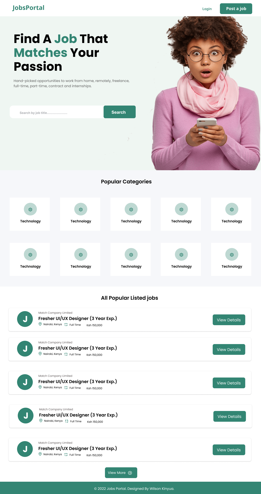
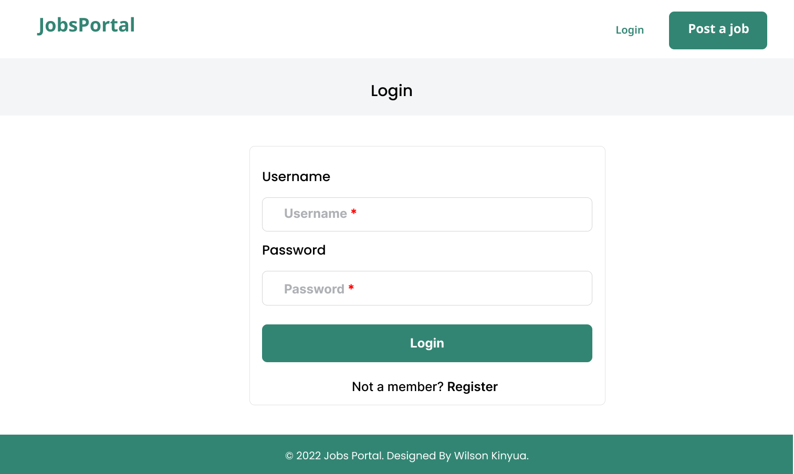
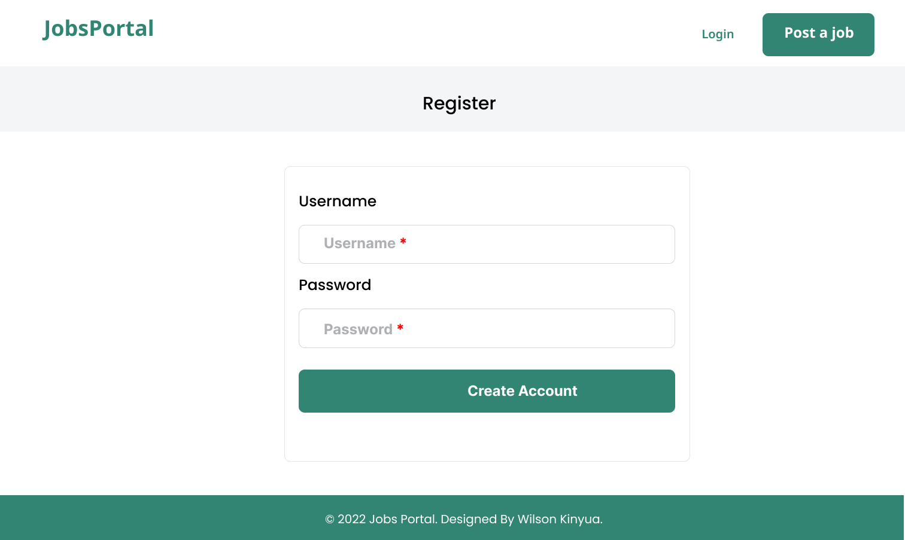

# JobsPortal

## Description

Jobs Portal is a a website that provides a way to create, update, delete and retrieve jobs. It also provides a way to create and retrieve a user.

## Setup Requirements

- Git
- Web Browser
- Github
- Angular CLI 
- Node.js
- npm

## Development server

Run `ng serve` for a dev server. Navigate to `http://localhost:4200/`. The app will automatically reload if you change any of the source files.

## Technologies Used

The following have been used on this project:

- HTML
- CSS
- Bootstrap
- Angular
<!-- 
## Screenshots Of the Figma Design

- Homepage

  

- Job Details

  

- Create Job Form Page

  

- Jobs List

  

- Login Page

  

- Register Page

   -->
